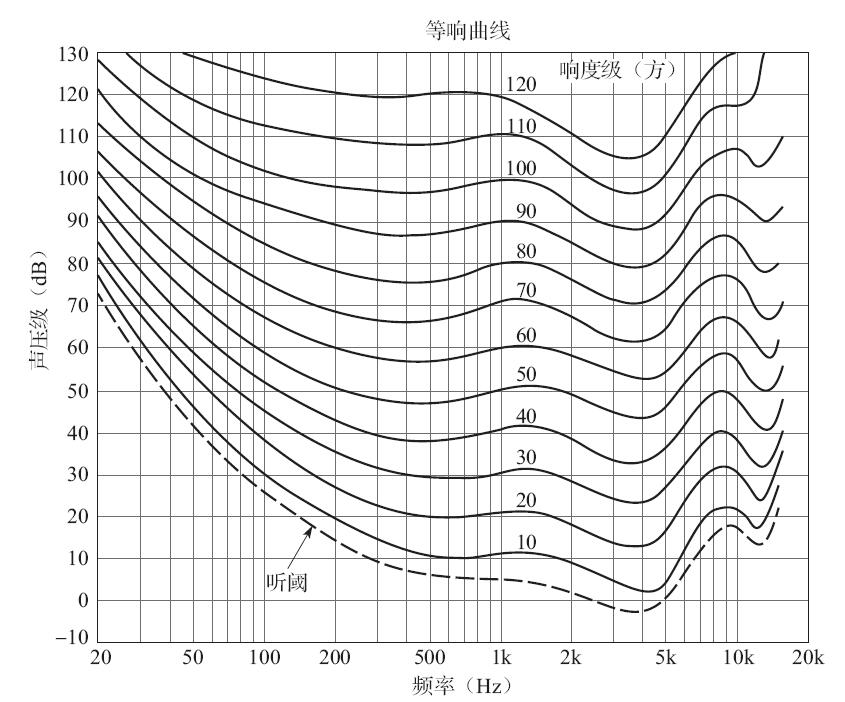

# 音视频基础概念

- [音视频基础概念](#音视频基础概念)
  - [声波的三要素](#声波的三要素)
  - [数字音频](#数字音频)
  - [音频编码](#音频编码)
  - [图像的数值表示](#图像的数值表示)
    - [RGB 表示方式](#rgb-表示方式)
    - [YUV 表示方式](#yuv-表示方式)
    - [YUV 和 RGB 的转化](#yuv-和-rgb-的转化)
  - [视频的编码方式](#视频的编码方式)
    - [视频编码](#视频编码)
    - [编码概念](#编码概念)
      - [IPB 帧](#ipb-帧)
      - [PTS 与 DTS](#pts-与-dts)
      - [GOP 的概念](#gop-的概念)

## 声波的三要素

声波的三要素是频率、振幅和波形，频率代表音阶的高低，振幅代表响度，波形代表音色。

频率（过零率）越高，波长就越短。低频声响的波长则较长，所以其可以更容易地绕过障碍物，因此能量衰减就小，声音就会传得远，反之则会得到完全相反的结论。

响度其实就是能量大小的反映，用不同的力度敲击桌子，声音的大小势必也会不同。在生活中，分贝常用于描述响度的大小。声音超过一定的分贝，人类的耳朵就会受不了。

音色其实也不难理解，在同样的音调（频率）和响度（振幅）下，钢琴和小提琴的声音听起来是完全不相同的，因为它们的音色不同。波的形状决定了其所代表声音的音色，钢琴和小提琴的音色不同就是因为它们的介质所产生的波形不同。

人类耳朵的听力有一个频率范围，大约是20Hz～20kHz，不过，即使是在这个频率范围内，不同的频率，听力的感觉也会不一样，业界非常著名的等响曲线，就是用来描述等响条件下声压级与声波频率关系的，如图所示。

人耳对3～4kHz频率范围内的声音比较敏感，而对于较低或较高频率的声音，敏感度就会有所减弱；在声压级较低时，听觉的频率特性会很不均匀；而在声压级较高时，听觉的频率特性会变得较为均匀。频率范围较宽的音乐，其声压以80～90dB为最佳，超过90dB将会损害人耳（105dB为人耳极限）。

## 数字音频

为了将模拟信号数字化，必须对信号依次进行采样、量化和编码。

**采样**是在时间轴上对信号进行数字化。根据奈奎斯特定理（也称为采样定理），按比声音最高频率高2倍以上的频率对声音进行采样（也称为AD转换），对于高质量的音频信号，其频率范围（人耳能够听到的频率范围）是20Hz～20kHz，所以采样频率一般为44.1kHz，这样就可以保证采样声音达到20kHz也能被数字化，从而使得经过数字化处理之后，人耳听到的声音质量不会被降低。而所谓的44.1kHz就是代表1秒会采样44100次。

**量化**是指在幅度轴上对信号进行数字化，比如用16比特的二进制信号来表示声音的一个采样，而16比特（一个short）所表示的范围是［-32768，32767］，共有65536个可能取值，因此最终模拟的音频信号在幅度上也分为了65536层。

**编码**是按照一定的格式记录采样和量化后的数字数据，比如顺序存储或压缩存储，等等。

这里面涉及了很多种格式，通常所说的音频的裸数据格式就是**脉冲编码调制**（Pulse Code Modulation，PCM）数据。描述一段 PCM 数据一般需要以下几个概念：**量化格式**（sampleFormat）、**采样率**（sampleRate）、**声道数**（channel）。以 CD 的音质为例：量化格式（有的地方描述为位深度）为 16 比特（2 字节），采样率为 44100，声道数为 2，这些信息就描述了 CD 的音质。而对于声音格式，还有一个概念用来描述它的大小，称为数据比特率，即 1 秒时间内的比特数目，它用于衡量音频数据单位时间内的容量大小。而对于CD音质的数据，比特率为多少呢？计算如下：

44100 * 16 * 2 = 1378.125 kbps

那么在 1 分钟里，这类 CD 音质的数据需要占据多大的存储空间呢？计算如下：

1378.125 * 60 / 8 / 1024 = 10.09 MB

存储的这段二进制数据即表示将模拟信号转换为数字信号了，以后就可以对这段二进制数据进行存储、播放、复制，或者进行其他任何操作。

**分贝**是用来表示声音强度的单位。日常生活中听到的声音，若以声压值来表示，由于其变化范围非常大，可以达到六个数量级以上，同时由于我们的耳朵对声音信号强弱刺激的反应不是线性的，而是呈对数比例关系，所以引入分贝的概念来表达声学量值。所谓分贝是指两个相同的物理量之比取以 10 为底的对数并乘以10，即：

N= 10 * lg（A1 / A0）

分贝符号为 `dB`，它是无量纲的。式中 A0 是基准量（或参考量），A1 是被量度量。

## 音频编码

压缩编码的基本指标之一就是压缩比，压缩比通常小于1（否则就没有必要去做压缩，因为压缩就是要减小数据容量）。压缩算法包括有损压缩和无损压缩。无损压缩是指解压后的数据可以完全复原。在常用的压缩格式中，用得较多的是有损压缩，有损压缩是指解压后的数据不能完全复原，会丢失一部分信息，压缩比越小，丢失的信息就越多，信号还原后的失真就会越大。根据不同的应用场景（包括存储设备、传输网络环境、播放设备等），可以选用不同的压缩编码算法，如 PCM、WAV、AAC、MP3、Ogg 等。

压缩编码的原理实际上是压缩掉冗余信号，冗余信号是指不能被人耳感知到的信号，包含人耳听觉范围之外的音频信号以及被掩蔽掉的音频信号等。而被掩蔽掉的音频信号则主要是因为人耳的掩蔽效应，主要表现为频域掩蔽效应与时域掩蔽效应，无论是在时域还是频域上，被掩蔽掉的声音信号都被认为是冗余信息，不进行编码处理。

## 图像的数值表示

### RGB 表示方式

任何一个图像都可以由 RGB 组成，那么一个像素点的 RGB 该如何表示呢？音频里面的每一个采样均使用 16 个比特来表示，那么像素里面的子像素又该如何表示呢？常用的表示方式有以下几种。

- 浮点表示：取值范围为 0.0～1.0，比如，在 OpenGL ES 中对每一个子像素点的表示使用的就是这种表达方式。
- 整数表示：取值范围为 0～255 或者 00～FF，8 个比特表示一个子像素，**32 个比特表示一个像素**，这就是类似于某些平台上表示图像格式的 RGBA_8888 数据格式。比如，Android平 台上 RGB_565 的表示方法为 16 比特模式表示一个像素，R 用 5 个比特来表示，G 用 6 个比特来表示，B 用 5 个比特来表示。

对于一幅图像，一般使用整数表示方法来进行描述，比如计算一张 1280×720 的 RGBA_8888 图像的大小，可采用如下方式：

1280 * 720 * 4 = 3.516 MB

这也是位图（bitmap）在内存中所占用的大小，所以每一张图像的裸数据都是很大的。对于图像的裸数据来讲，直接在网络上进行传输也是不太可能的，所以就有了图像的压缩格式，比如JPEG压缩：JPEG是静态图像压缩标准，由ISO制定。JPEG图像压缩算法在提供良好的压缩性能的同时，具有较好的重建质量。这种算法被广泛应用于图像处理领域，当然其也是一种有损压缩。

但是，这种压缩不能直接应用于视频压缩，因为对于视频来讲，还有一个时域上的因素需要考虑，也就是说，不仅仅要考虑帧内编码，还要考虑帧间编码。

### YUV 表示方式

对于视频帧的裸数据表示，更多的是 YUV 数据格式的表示，YUV 主要应用于优化彩色视频信号的传输，使其向后兼容老式黑白电视。与 RGB 视频信号传输相比，它最大的优点在于只需要占用极少的频宽（RGB 要求三个独立的视频信号同时传输）。其中 “Y” 表示明亮度（Luminance 或 Luma），也称灰阶值；而 “U” 和 “V” 表示的则是色度（Chrominance或Chroma），它们的作用是描述影像的色彩及饱和度，用于指定像素的颜色。“亮度”是透过 RGB 输入信号来建立的，方法是将 RGB 信号的特定部分叠加到一起。“色度”则定义了颜色的两个方面——色调与饱和度，分别用 Cr 和 Cb 来表示。其中，Cr 反映了 RGB 输入信号红色部分与 RGB 信号亮度值之间的差异，而 Cb 反映的则是 RGB 输入信号蓝色部分与 RGB 信号亮度值之间的差异。

之所以采用 YUV 色彩空间，是因为它的亮度信号 Y 和色度信号 U、V 是分离的。如果只有 Y 信号分量而没有 U、V 分量，那么这样表示的图像就是黑白灰度图像。彩色电视采用 YUV 空间正是为了用亮度信号 Y 解决彩色电视机与黑白电视机的兼容问题，使黑白电视机也能接收彩色电视信号，最常用的表示形式是 Y、U、V 都使用8个字节来表示，所以取值范围就是 0～255。在广播电视系统中不传输很低和很高的数值，实际上是为了防止信号变动造成过载，因而把这“两边”的数值作为“保护带”，不论是 Rec.601 还是 BT.709 的广播电视标准中，Y 的取值范围都是 16～235，UV 的取值范围都是 16～240。

YUV 最常用的采样格式是 4:2:0，4:2:0 并不意味着只有 Y、Cb 而没有 Cr 分量。它指的是对每行扫描线来说，只有一种色度分量是以 2:1 的抽样率来存储的。相邻的扫描行存储着不同的色度分量，也就是说，如果某一行是 4:2:0，那么其下一行就是 4:0:2，再下一行是 4:2:0，以此类推。对于每个色度分量来说，水平方向和竖直方向的抽样率都是 2:1，所以可以说色度的抽样率是 4:1。对非压缩的 8 比特量化的视频来说，8×4 的一张图片需要占用 48 字节的内存

相较于 RGB，我们可以计算一帧为 1280×720 的视频帧，用 YUV420P 的格式来表示，其数据量的大小如下：

1280 * 720 * 1 ＋ 1280 * 720 * 0.5 = 1.318MB

如果 fps（1秒的视频帧数目）是 24，按照一般电影的长度 90 分钟来计算，那么这部电影用 YUV420P 的数据格式来表示的话，其数据量的大小就是：

1.318MB * 24fps * 90min * 60s = 166.8GB

### YUV 和 RGB 的转化

凡是渲染到屏幕上的东西（文字、图片或者其他），都要转换为 RGB 的表示形式，不同设备的转换标准各有不同，必须寻找对应的文档，以找出适合的转换矩阵进行转换。

## 视频的编码方式

### 视频编码

相较于音频数据，视频数据有极强的相关性，也就是说有大量的冗余信息，包括空间上的冗余信息和时间上的冗余信息。

使用帧间编码技术可以去除时间上的冗余信息，具体包括以下几个部分。

- 运动补偿：运动补偿是通过先前的局部图像来预测、补偿当前的局部图像，它是减少帧序列冗余信息的有效方法。
- 运动表示：不同区域的图像需要使用不同的运动矢量来描述运动信息。
- 运动估计：运动估计是从视频序列中抽取运动信息的一整套技术。

使用帧内编码技术可以去除空间上的冗余信息。

对于视频，ISO 同样也制定了标准：Motion JPEG 即 MPEG，MPEG 算法是适用于动态视频的压缩算法，它除了对单幅图像进行编码外，还利用图像序列中的相关原则去除冗余，这样可以大大提高视频的压缩比。

相比较于 ISO 制定的 MPEG 的视频压缩标准，ITU-T 制定的 H.261、H.262、H.263、H.264 一系列视频编码标准是一套单独的体系。其中，H.264 集中了以往标准的所有优点，并吸取了以往标准的经验，采用的是简洁设计，这使得它比 Mpeg4 更容易推广。现在使用最多的就是 H.264 标准，H.264 创造了多参考帧、多块类型、整数变换、帧内预测等新的压缩技术，使用了更精细的分像素运动矢量（1/4、1/8）和新一代的环路滤波器，这使得压缩性能得到大大提高，系统也变得更加完善。

### 编码概念

#### IPB 帧

视频压缩中，每帧都代表着一幅静止的图像。而在进行实际压缩时，会采取各种算法以减少数据的容量，其中 IPB 帧就是最常见的一种。

- I 帧：**帧内编码帧**（intra picture），I 帧通常是每个 GOP（MPEG 所使用的一种视频压缩技术）的第一个帧，经过适度地压缩，作为随机访问的参考点，**可以当成静态图像**。I 帧可以看作一个图像经过压缩后的产物，I 帧压缩可以得到 6:1 的压缩比而不会产生任何可觉察的模糊现象。
- P 帧：**前向预测编码帧**（predictive-frame），通过将图像序列中前面已编码帧的时间冗余信息充分去除来压缩传输数据量的编码图像，也称为预测帧。
- B 帧：**双向预测内插编码帧**（bi-directional interpolated prediction frame），既考虑源图像序列前面的已编码帧，又顾及源图像序列后面的已编码帧之间的时间冗余信息，来压缩传输数据量的编码图像，也称为**双向预测帧**。

I 帧压缩可去掉视频的空间冗余信息，P 帧和 B 帧是为了去掉时间冗余信息。

- I 帧自身可以通过视频解压算法解压成一张单独的完整视频画面，所以 I 帧去掉的是视频帧在空间维度上的冗余信息。
- P 帧需要参考其前面的一个 I 帧或者 P 帧来解码成一张完整的视频画面。
- B 帧则需要参考其前一个 I 帧或者 P 帧及其后面的一个 P 帧来生成一张完整的视频画面，所以 P 帧与 B 帧去掉的是视频帧在时间维度上的冗余信息。

IDR 帧与 I 帧的理解

在 H264 的概念中有一个帧称为 IDR 帧，IDR 的英文全称 instantaneous decoding refresh picture，因为 H264 采用了多帧预测，所以 I 帧之后的 P 帧有可能会参考I帧之前的帧，这就使得在随机访问的时候不能以找到I帧作为参考条件，因为即使找到I帧，I帧之后的帧还是有可能解析不出来，而 IDR 帧就是一种特殊的 I 帧，即这一帧之后的所有参考帧只会参考到这个 IDR 帧，而不会再参考前面的帧。在解码器中，一旦收到一个 IDR 帧，就会立即清理参考帧缓冲区，并将 IDR 帧作为被参考的帧。

#### PTS 与 DTS

DTS 主要用于视频的解码，英文全称是 Decoding Time Stamp，PTS 主要用于在解码阶段进行视频的同步和输出，全称是 Presentation Time Stamp。在没有 B 帧的情况下，DTS 和 PTS 的输出顺序是一样的。因为 B 帧打乱了解码和显示的顺序，所以一旦存在 B 帧，PTS 与 DTS 势必就会不同。

FFmpeg 中使用 AVPacket 结构体来描述解码前或编码后的压缩数据，用 AVFrame 结构体来描述解码后或编码前的原始数据。对于视频来说，AVFrame 就是视频的一帧图像，这帧图像什么时候显示给用户，取决于它的 PTS。DTS 是 AVPacket 里的一个成员，表示该压缩包应该在什么时候被解码，如果视频里各帧的编码是按输入顺序（显示顺序）依次进行的，那么解码和显示时间应该是一致的，但是事实上，在大多数编解码标准（如 H.264 或 HEVC）中，编码顺序和输入顺序并不一致，于是才会需要 PTS 和 DTS 这两种不同的时间戳。

#### GOP 的概念

两个 I 帧之间形成的一组图片，就是 GOP（Group Of Picture）的概念。通常在为编码器设置参数的时候，必须要设置 gop_size 的值，其代表的是两个 I 帧之间的帧数目。前面已经讲解过，一个 GOP 中容量最大的帧就是 I 帧，所以相对来讲，gop_size 设置得越大，整个画面的质量就会越好，但是在解码端必须从接收到的第一个I帧开始才可以正确解码出原始图像，否则会无法正确解码（这也是前面提到的I帧可以作为随机访问的帧）。在提高视频质量的技巧中，还有个技巧是多使用 B 帧，一般来说，I 的压缩率是7（与JPG差不多），P 是 20，B 可以达到50，可见使用 B 帧能节省大量空间，节省出来的空间可以用来更多地保存 I 帧，这样就能在相同的码率下提供更好的画质。所以我们要根据不同的业务场景，适当地设置 gop_size 的大小，以得到更高质量的视频。
